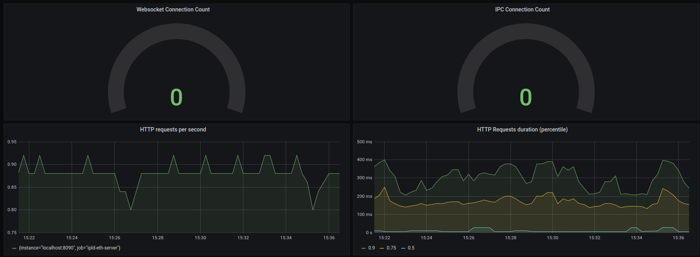

# ipld-eth-server

[](https://goreportcard.com/report/github.com/vulcanize/ipld-eth-server)

>  ipld-eth-server is the server backend for indexed ETH IPLD objects

## Table of Contents
1. [Background](#background)
1. [Install](#install)
1. [Usage](#usage)
1. [Contributing](#contributing)
1. [License](#license)

## Background
NOTE: WIP

ipld-eth-server is used to service queries against the Ethereum IPLD objects indexed by [ipld-eth-indexer](https://github.com/vulcanize/ipld-eth-indexer).

It exposes standard Ethereum JSON RPC endpoints on top of the database, in some cases these endpoints can leverage the unique indexes to improve query performance.
Additional, unique endpoints are exposed which utilize the new indexes and state diff data objects.


## Dependencies
Minimal build dependencies
* Go (1.13)
* Git
* GCC compiler
* This repository

External dependency
* Postgres database populated by [ipld-eth-indexer](https://github.com/vulcanize/ipld-eth-indexer)

## Install
Start by downloading ipld-eth-server and moving into the repo:

`GO111MODULE=off go get -d github.com/vulcanize/ipld-eth-server`

`cd $GOPATH/src/github.com/vulcanize/ipld-eth-server`

Then, build the binary:

`make build`

## Usage
After building the binary, run as

`./ipld-eth-server serve --config=<the name of your config file.toml>`

### Configuration

Below is the set of parameters for the ipld-eth-server command, in .toml form, with the respective environmental variables commented to the side.
The corresponding CLI flags can be found with the `./ipld-eth-server serve --help` command.

```toml
[database]
    name     = "vulcanize_public" # $DATABASE_NAME
    hostname = "localhost" # $DATABASE_HOSTNAME
    port     = 5432 # $DATABASE_PORT
    user     = "postgres" # $DATABASE_USER
    password = "" # $DATABASE_PASSWORD

[log]
    level = "info" # $LOGRUS_LEVEL

[server]
    ipcPath = "~/.vulcanize/vulcanize.ipc" # $SERVER_IPC_PATH
    wsPath = "127.0.0.1:8081" # $SERVER_WS_PATH
    httpPath = "127.0.0.1:8082" # $SERVER_HTTP_PATH
    graphql = true # $SERVER_GRAPHQL
    graphqlEndpoint = "" # $SERVER_GRAPHQL_ENDPOINT

[ethereum]
    chainID = "1" # $ETH_CHAIN_ID
    defaultSender = "" # $ETH_DEFAULT_SENDER_ADDR
    rpcGasCap = "1000000000000" # $ETH_RPC_GAS_CAP
    httpPath = "127.0.0.1:8545" # $ETH_HTTP_PATH
    nodeID = "arch1" # $ETH_NODE_ID
    clientName = "Geth" # $ETH_CLIENT_NAME
    genesisBlock = "0xd4e56740f876aef8c010b86a40d5f56745a118d0906a34e69aec8c0db1cb8fa3" # $ETH_GENESIS_BLOCK
    networkID = "1" # $ETH_NETWORK_ID
```

The `database` fields are for connecting to a Postgres database that has been/is being populated by [ipld-eth-indexer](https://github.com/vulcanize/ipld-eth-indexer)  
The `server` fields set the paths for exposing the ipld-eth-server endpoints  
The `ethereum` fields set the chainID and default sender address to use for EVM simulation, and can optionally be used to configure a remote eth node to forward cache misses to  


### Endpoints
#### IPLD subscription
TODO: Port the IPLD RPC subscription endpoints after the decoupling

#### Ethereum JSON-RPC
ipld-eth-server currently recapitulates portions of the Ethereum JSON-RPC api standard.

The currently supported standard endpoints are:  
`eth_call`  
`eth_getBalance`  
`eth_getStorageAt`  
`eth_getCode`  
`eth_getProof`  
`eth_blockNumber`  
`eth_getHeaderByNumber`  
`eth_getHeaderByHash`  
`eth_getBlockByNumber`  
`eth_getBlockByHash`  
`eth_getTransactionCount`  
`eth_getBlockTransactionCountByHash`  
`eth_getBlockTransactionCountByNumber`  
`eth_getTransactionByHash`  
`eth_getRawTransactionByHash`  
`eth_getTransactionByBlockHashAndIndex`  
`eth_getTransactionByBlockNumberAndIndex`  
`eth_getRawTransactionByBlockHashAndIndex`  
`eth_getRawTransactionByBlockNumberAndIndex`  
`eth_getTransactionReceipt`  
`eth_getLogs`  
`eth_getUncleCountByBlockHash`  
`eth_getUncleCountByBlockNumber`  
`eth_getUncleByBlockHashAndIndex`  
`eth_getUncleByBlockNumberAndIndex`  

TODO: Add the rest of the standard endpoints and unique endpoints (e.g. getSlice)


### CLI Options and Environment variables


| CLI Option                    | Environment Variable          | Default Value    | Comment                             |
| ----------------------------- | ----------------------------- | ---------------- | ----------------------------------- |
| `database-hostname`           | `DATABASE_HOSTNAME`           | localhost        | IPLD database host                  |
| `database-port`               | `DATABASE_PORT`               | 5432             | IPLD database port                  |
| `database-name`               | `DATABASE_NAME`               | vulcanize_public | IPLD database name                  |
| `database-user`               | `DATABASE_USER`               |                  | IPLD database user                  |
| `database-password`           | `DATABASE_PASSWORD`           |                  | IPLD database password              |
| `eth-server-graphql`          | `ETH_SERVER_GRAPHQL`          | false            | If `true` enable Eth GraphQL Server |
| `eth-server-graphql-path` | `ETH_SERVER_GRAPHQLPATH` |                  | If `eth-server-graphql` set to true, endpoint url for graphql server (host:port)                               |
| `eth-server-http`          | `ETH_SERVER_HTTP`          | true            | If `true` enable Eth HTTP JSON-RPC Server |
| `eth-server-http-path`          | `ETH_SERVER_HTTP_PATH`          |             | If `eth-server-http` set to `true`, endpoint url for Eth HTTP JSON-RPC server (host:port)  |
| `eth-server-ws`          | `ETH_SERVER_WS`          | false            | If `true` enable Eth WS JSON-RPC Server |
| `eth-server-ws-path`          | `ETH_SERVER_WS_PATH`          |             | If `eth-server-ws` set to `true`, endpoint url for Eth WS JSON-RPC server (host:port)  |
| `eth-server-ipc`          | `ETH_SERVER_IPC`          | false            | If `true` enable Eth IPC JSON-RPC Server |
| `eth-server-ipc-path`          | `ETH_SERVER_IPC_PATH`          |             | If `eth-server-ws` set to `true`, path for Eth IPC JSON-RPC server |
| `ipld-server-graphql`          | `IPLD_SERVER_GRAPHQL`          | false            | If `true` enable IPLD GraphQL Server |
| `ipld-server-graphql-path` | `IPLD_SERVER_GRAPHQLPATH` |                  | If `ipld-server-graphql` set to true, endpoint url for graphql server (host:port)                               |
| `ipld-postgraphile-path` | `IPLD_POSTGRAPHILEPATH` |                  | If `ipld-server-graphql` set to true, http url for postgraphile server on top of IPLD db                        |
| `tracing-http-path` | `TRACING_HTTPPATH` |                  | If `ipld-server-graphql` set to true, http url for tracing server                        |
| `tracing-postgraphile-path` | `TRACING.POSTGRAPHILEPATH` |                  | If `ipld-server-graphql` set to true, http url for postgraphile server on top of tracing db                        |


### Testing
`make test` will run the unit tests  
`make test` setups a clean `vulcanize_testing` db

## Monitoring

* Enable http server and metrics using parameters `--http --metrics`
* ipld-eth-server exposes prometheus metrics at `/metric` endpoint
* start prometheus using `monitoring/prometheus.yml` config (`prometheus --config.file=monitoring/prometheus.yml`)
* start grafana, connect to prometheus datasource and import dashboard from `monitoring/grafana/dashboard_main.json`




## Contributing
Contributions are welcome!

VulcanizeDB follows the [Contributor Covenant Code of Conduct](https://www.contributor-covenant.org/version/1/4/code-of-conduct).

## License
[AGPL-3.0](LICENSE) © Vulcanize Inc
